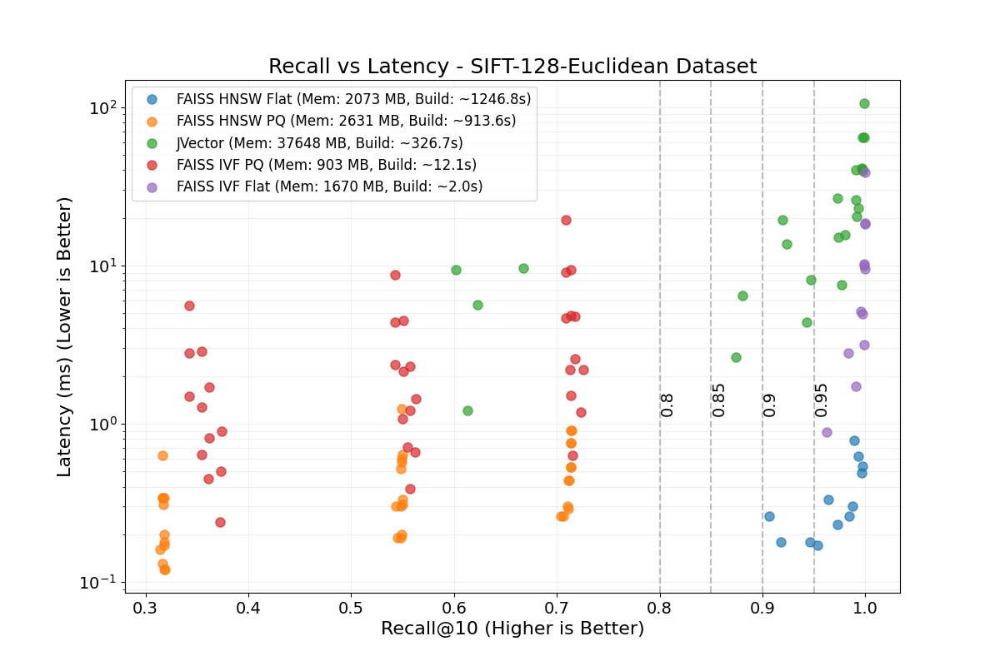
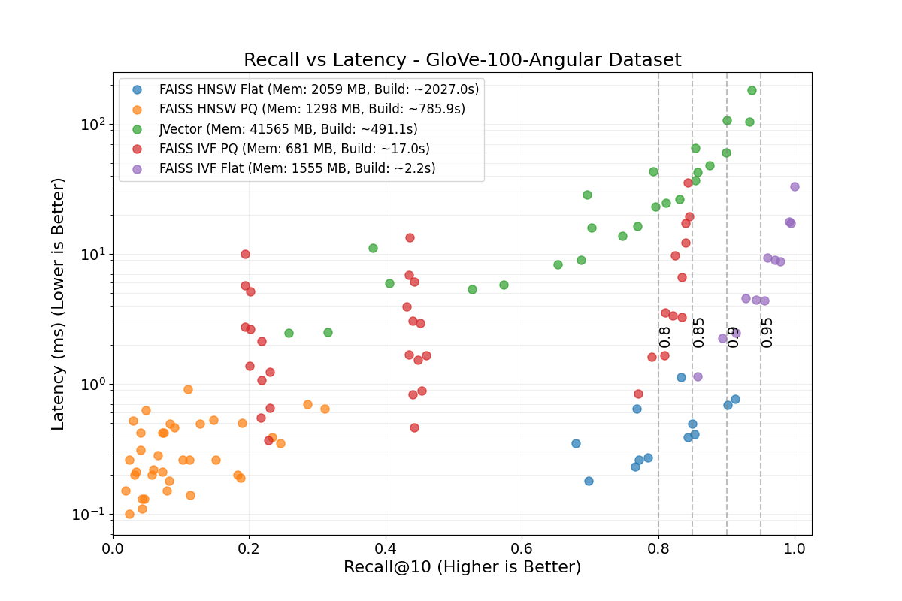

# Vector Search Benchmark: ArcadeDB (JVector) vs FAISS

This benchmark compares the performance of **ArcadeDB's Vector Index** (based on JVector + LSM Tree) against **FAISS** (Facebook AI Similarity Search) using standard ANN datasets.

## 1. Algorithms Tested

We evaluated the following vector index implementations:

*   **ArcadeDB (JVector + LSM)**: ArcadeDB uses JVector for graph-based vector indexing, integrated with an LSM-tree architecture to provide transactional, persistent, and database-like capabilities. JVector combines the best of **HNSW** (Hierarchical Navigable Small World) and **DiskANN** algorithms to offer high performance on disk-based indexes.
*   **FAISS**: We tested four popular index types:
    *   `HNSW` (Hierarchical Navigable Small World) - Graph-based.
    *   `HNSW_PQ` (HNSW with Product Quantization) - Graph + Compressed.
    *   `IVF_FLAT` (Inverted File with Flat vectors) - Quantization-based.
    *   `IVF_PQ` (Inverted File with Product Quantization) - Compressed.

## 2. Datasets

We used two widely recognized datasets from `ann-benchmarks`:

1.  **SIFT-128-Euclidean**
    *   **Vectors**: 1,000,000
    *   **Dimensions**: 128
    *   **Metric**: Euclidean Distance
    *   **Difficulty**: Moderate.

2.  **GloVe-100-Angular**
    *   **Vectors**: ~1.2 Million (1,183,514)
    *   **Dimensions**: 100
    *   **Metric**: Cosine Similarity
    *   **Difficulty**: Hard. As seen in the results, all algorithms achieve lower recall values compared to SIFT for the same parameters.

## 3. Hardware Environment

All benchmarks were executed on the following hardware:

*   **CPU**: AMD Ryzen 9 7950X 16-Core Processor
*   **RAM**: 128 GB DDR5 (4×32 GB) at 3600 MT/s (Corsair)
*   **Disk**: Samsung SSD 970 EVO Plus 2TB
*   **GPU**: None (All benchmarks ran on CPU)

## 4. Benchmark Results

The following figures visualize the trade-off between **Recall@10** and **Latency (ms)**.

*   **X-Axis (Recall)**: Higher is better (Right).
*   **Y-Axis (Latency)**: Lower is better (Down).
*   **Goal**: The ideal performance is in the **bottom-right corner** (High Recall, Low Latency).

Each dot represents a specific configuration (parameter set) for an algorithm. We use scatter plots because connecting dots with lines implies a continuum that doesn't strictly exist across different discrete parameter combinations (e.g., `max_connections`, `ef_construction`, `nprobe`).

For detailed parameter values and raw metrics, please refer to the markdown files in the [`./results/`](./results/) directory.

### Note on Legend Metrics

The legend in the figures displays **Peak Memory** and **Avg Build** time. These metrics should be interpreted with the following context:

*   **Peak Memory**: This represents the **global maximum RSS** (Resident Set Size) observed during the entire benchmark run for that algorithm. Since the script iterates through multiple parameter configurations (some heavier than others) in a single run, this value reflects the high-water mark of the most resource-intensive configuration, not necessarily the specific memory usage for every data point shown.
*   **Avg Build**: This is the **arithmetic mean** of the build times across all configurations tested for that algorithm. As build time varies significantly with parameters (e.g., `max_connections`, `ef_construction`), this serves as a general ballpark figure rather than a precise measurement for each specific point.

### SIFT-128-Euclidean Results


*(PDF version: [figures/plot_sift-128-euclidean.pdf](figures/plot_sift-128-euclidean.pdf))*

### GloVe-100-Angular Results


*(PDF version: [figures/plot_glove-100-angular.pdf](figures/plot_glove-100-angular.pdf))*

## 5. ArcadeDB Configuration

For ArcadeDB, we selected the following default configuration which offers a balanced trade-off between build time, memory usage, and search performance:

```python
max_connections = 32
beam_width = 200
overquery_factor = 16
```
**Note on `overquery_factor`**: Unlike FAISS or standard HNSW implementations, JVector does not use an `ef` (or `efSearch`) parameter during search. Instead, we implemented an **"overquery"** mechanism. This retrieves `k * overquery_factor` candidates from the index, sorts them by exact similarity, and returns the top `k`. This allows trading off latency for higher recall.
On the **GloVe-100-Angular** dataset (~1.2M vectors), this configuration achieved:
*   **Recall@10**: 0.8538
*   **Average Latency**: 36ms
*   **Build Time**: ~530 seconds

We consider this "quite decent" for a persistent, disk-based vector store compared to purely in-memory libraries.
